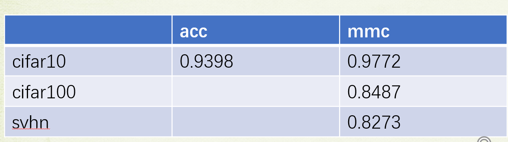

九月份最新CODEs_sp重构代码
[toc]

# 代码结构

代码在code文件夹下.

## 训练分类器作为baseline

train_resnet_baseline.py :用于训练baseline resent18分类器

目前试验结果:

## 训练ae

train_ae_with_mseloss.py : 使用mse loss 训练ae重构cifar10数据集

train_ae_with : 训练ae生成虚假图像

## 压制训练
